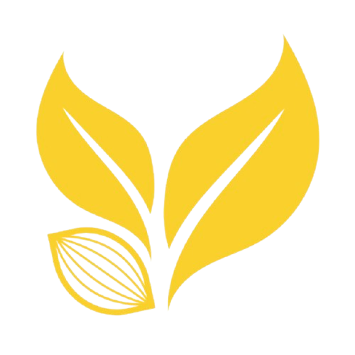

<div align="center">
  
  <h1>J-SMART CACAO 🍫🌿</h1>
  <p><strong>Dari Kebun Jembrana, Menuju Dunia</strong></p>
  <p>Ekosistem digital terintegrasi yang menyatukan IoT, Blockchain (Cloud Ledger), dan Agrowisata untuk mengangkat potensi kakao premium Bali.</p>

  <div>
    
    
    
    
    
  </div>
</div>

<br />


## 📖 Tentang Proyek

**J-SMART CACAO** adalah platform inovatif hulu-ke-hilir yang dirancang khusus untuk mengatasi *Paradoks Pariwisata Bali* di Kabupaten Jembrana. Meskipun menyumbang 67% produksi kakao di Bali, Jembrana minim kunjungan wisatawan.

Platform ini hadir untuk menjembatani kesenjangan tersebut melalui pendekatan **Pentahelix**, menggabungkan teknologi presisi (IoT Smart Dryer) di tingkat petani dengan edukasi interaktif (Edu-tourism), pelacakan transparan (Cloud Ledger), dan promosi agrowisata cerdas via kemasan produk (Smart Packaging).

## ✨ Fitur Utama

- 🔍 **Keterlacakan (Traceability) Real-time**
  Sistem pelacakan *Farm-to-Bar* yang transparan menggunakan teknologi *Cloud Ledger* anti-manipulasi. Pindai QR di kemasan, ketahui profil petani, lokasi kebun, hingga metrik kualitas panen.
- 🌡️ **Smart Dryer IoT Integration**
  Pemantauan suhu & kelembapan proses pengeringan kakao dari kabinet hibrida bertenaga surya. Memastikan kualitas biji kakao premium (kadar air 7% sesuai SNI) dalam 3 hari, bebas dari ketergantungan cuaca.
- 🎭 **Edu-Tourism Interaktif (3D Experience)**
  Eksplorasi budaya Jembrana (Gamelan Jegog, Tradisi Mekepung, Sistem Subak Abian) secara interaktif dengan model 3D menggunakan `React Three Fiber`.
- 🗺️ **Pusat Agrowisata**
  Portal pemesanan paket agrowisata untuk menjaring turis dari Bali Selatan berkunjung langsung ke kebun kakao di Jembrana.
- 🌗 **Bilingual & Dark Mode Support**
  Antarmuka dinamis yang mendukung Bahasa Indonesia & English, serta transisi mulus antara tema Gelap dan Terang.

## 🛠️ Tech Stack

Platform ini dibangun menggunakan teknologi web modern untuk menjamin performa, aksesibilitas, dan *developer experience* yang optimal:

- **Framework**: [Next.js 15 (App Router)](https://nextjs.org/)
- **Styling**: [Tailwind CSS](https://tailwindcss.com/)
- **Animasi**: [Framer Motion](https://www.framer.com/motion/)
- **3D Render**: [React Three Fiber](https://docs.pmnd.rs/react-three-fiber/) & Drei
- **Icons**: [Lucide React](https://lucide.dev/)
- **State Management**: Zustand
- **Bahasa**: TypeScript

## 🚀 Panduan Instalasi (Getting Started)

Ikuti langkah-langkah berikut untuk menjalankan J-SMART CACAO secara lokal di mesin Anda.

### 1. Kloning Repositori
```bash
git clone https://github.com/username/j-smart-cacao.git
cd j-smart-cacao
```

### 2. Install Dependensi
```bash
npm install
# atau
yarn install
```

### 3. Jalankan Development Server
```bash
npm run dev
# atau
yarn dev
```

Buka [http://localhost:3000](http://localhost:3000) di browser Anda untuk melihat hasilnya.

## 📂 Struktur Direktori Utama

```text
src/
├── app/                  # Next.js 15 App Router pages
│   ├── budaya/           # Halaman Edu-Tourism & 3D Model
│   ├── teknologi/        # Halaman Penjelasan Smart Dryer IoT
│   ├── telusuri/         # Halaman Eksplorasi Agrowisata
│   ├── trace/            # Halaman Traceability & Cloud Ledger
│   ├── globals.css       # Global styles & Tailwind config
│   ├── layout.tsx        # Root layout (Navbar & Footer terintegrasi)
│   └── page.tsx          # Beranda (Landing Page)
├── components/           # Reusable UI components
│   ├── 3d/               # Komponen spesifik React Three Fiber
│   ├── layout/           # Navbar, Footer, dll
│   └── ui/               # Buttons, Cards, Modals
├── store/                # Zustand stores (Theme & Language state)
└── lib/                  # Helper utilities
```

## 🤝 Kontribusi

Kami menyambut baik segala bentuk kontribusi! Jika Anda menemukan *bug* atau memiliki ide fitur baru:
1. *Fork* repositori ini.
2. Buat *branch* fitur Anda (`git checkout -b feature/FiturKeren`).
3. *Commit* perubahan Anda (`git commit -m 'Menambahkan FiturKeren'`).
4. *Push* ke *branch* tersebut (`git push origin feature/FiturKeren`).
5. Buka *Pull Request*.

## 📜 Lisensi & Pengakuan

- **Desain & Konsep**: Mahasiswa Universitas Udayana (2026)
- **Data & Riset**: Didukung oleh BPS Bali & Dinas Pariwisata Bali (Data representatif tahun 2025/2026).
- **Lisensi**: MIT License.

---
<div align="center">
  <i>Dibuat dengan ❤️ untuk petani kakao Jembrana, Bali.</i>
</div>
